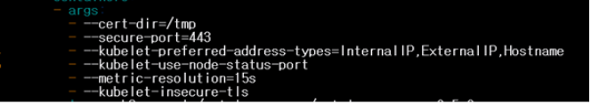

## 도커설치   
[도커설치 공식문서 링크](https://docs.docker.com/engine/install/ubuntu/#install-using-the-repository) for ubuntu   
```
sudo apt-get update

sudo apt-get install \
    apt-transport-https \
    ca-certificates \
    curl \
    gnupg \
    lsb-release
curl -fsSL https://download.docker.com/linux/ubuntu/gpg | sudo gpg --dearmor -o /usr/share/keyrings/docker-archive-keyring.gpg

echo \
  "deb [arch=amd64 signed-by=/usr/share/keyrings/docker-archive-keyring.gpg] https://download.docker.com/linux/ubuntu \
  $(lsb_release -cs) stable" | sudo tee /etc/apt/sources.list.d/docker.list > /dev/null

sudo apt-get update

sudo apt-get install docker-ce docker-ce-cli containerd.io

sudo docker run hello-world ##설치확인
```

## kubeadm, kubelet, kubectl 설치
* 컨트롤플레인, 노드 공통 작업   
```
sudo apt-get update
sudo apt-get install -y apt-transport-https ca-certificates curl


sudo curl -fsSLo /usr/share/keyrings/kubernetes-archive-keyring.gpg https://packages.cloud.google.com/apt/doc/apt-key.gpg


echo "deb [signed-by=/usr/share/keyrings/kubernetes-archive-keyring.gpg] https://apt.kubernetes.io/ kubernetes-xenial main" | sudo tee /etc/apt/sources.list.d/kubernetes.list


sudo apt-get update
sudo apt-get -y install kubeadm=1.19.12-00 kubectl=1.19.12-00 kubelet=1.19.12-00
sudo apt-mark hold kubelet kubeadm kubectl
```
## 클러스터 구성(워커노드 1개, calico 네트워크 대역 사용)
* 컨트롤 플레인에서..   
```
sudo kubeadm init --control-plane-endpoint 192.168.200.50 --pod-network-cidr 192.168.0.0/16 --apiserver-advertise-address 192.168.200.50
```  
   init 명령어 끝나면 join 명령어를 제시해준다
```
mkdir -p $HOME/.kube
sudo cp -i /etc/kubernetes/admin.conf $HOME/.kube/config
sudo chown $(id -u):$(id -g) $HOME/.kube/config


kubectl apply -f https://docs.projectcalico.org/manifests/calico.yaml

kubectl taint nodes --all node-role.kubernetes.io/master- # 이거해줘야 rook-ceph 정상적으로 받아올 수 있다. 노드1개의 클러스터 구성이므로 수행
```
* 워커노드에서...   
```
sudo kubeadm join <컨트롤플레인 ip>:<포트> --token <토큰찾은거> --discovery-token-ca-cert-hash <해시값 찾은거>
```   
* 해시값, 토큰 찾는 방법
```
#토큰 찾기
kubeadm token list # k-control에서
#해시값 찾기
openssl x509 -pubkey -in /etc/kubernetes/pki/ca.crt | openssl rsa -pubin -outform der 2>/dev/null | \
   openssl dgst -sha256 -hex | sed 's/^.* //'
```

## K8s 버전관리, 버전업그레이드, 노드 추가&삭제
\
[버전의 차이 용인여부 확인 링크](https://kubernetes.io/ko/releases/version-skew-policy/#kubectl)   
**API Server 가 가장먼저 업그레이드 되어야한다.**      

**kubelet**   
kubelet은 kube-apiserver보다 최신일 수 없으며, 2단계의 낮은 마이너 버전까지 지원한다.
따라서 kubelet upgrade 전에 apiserver를 먼저 업그레이드해줘야한다.   

**Kube-controller, kube-scheduler, cloud-controller-manager**   

kube-controller-manager, kube-scheduler 그리고 cloud-controller-manager는 그들과 통신하는 kube-apiserver 인스턴스보다 최신 버전이면 안 된다. kube-apiserver 마이너 버전과 일치할 것으로 예상하지만, 최대 한 단계 낮은 마이너 버전까지는 허용한다(실시간 업그레이드를 지원하기 위해서)   

**kubectl**   
kubectl은 kube-apiserver의 한 단계 마이너 버전(이전 또는 최신) 내에서 지원한다.     
\
\
API server -> kubeadm(kube-controller-manager, kube-scheduler, cloud-controller-manager) -> kublet,kubectl 순서로 업그레이드

**원칙**: 마이너버전 2개를 뛰어넘어서 업그레이드 불가하다. \
Ex) 1.18.19-00 → 1.20.03-00 (X)\
1.18.19-00 → 1.19.12-00 → 1.20.03-00 (O)   

* control plane에서..

#kubeadm 설치에서 apt-mark hold 로 전체 업데이트시에 kubeadm, kubelet, kubectl 등을 같이 업그레이드 되지 않게 hold 해놨는데 held package의 업데이트를 허용 명령어 수행
```
sudo apt-get update && sudo apt-get install -y --allow-change-held-packages kubeadm=1.18.20-00

sudo kubeadm upgrade plan
sudo kubeadm upgrade apply v1.18.20

sudo apt-get update && \
    sudo apt-get install -y --allow-change-held-packages kubelet=1.18.20-00 kubectl=1.18.20-00

sudo systemctl daemon-reload
sudo systemctl restart kubelet
```
* node 에서..   
```
sudo apt-get update && \
sudo apt-get install -y --allow-change-held-packages kubeadm=1.18.20-00


sudo kubeadm upgrade node

sudo apt-get update && \
sudo apt-get install -y --allow-change-held-packages kubelet=1.18.20-00 kubectl=1.18.20-00


sudo systemctl daemon-reload &&\
sudo systemctl restart kubelet

kubectl get nodes 로 1.18.20 버전 확인
```
* 노드 추가,삭제   
클러스터 구성에 노드를 추가: kubeadm join 명령문을 새로 생성한 노드에 적용해주면 되는데
가정:
 docker run time이 설치되어있다.
kubectl, kubelet, kubeadm 버전의 SKEW가 Control Plane과 일치
가정에 맞다면

토큰찾기:    
kubeadm token list # k-control에서
해쉬값 찾기:    
openssl x509 -pubkey -in /etc/kubernetes/pki/ca.crt | openssl rsa -pubin -outform der 2>/dev/null | \
   openssl dgst -sha256 -hex | sed 's/^.* //'


조인하기:   
sudo kubeadm join 192.168.200.50:6443 --token <토큰찾은거> --discovery-token-ca-cert-hash <해시값 찾은거>

클러스터 구성에서 노드를 삭제   

*해당 노드에서..   
kubeadm reset 
output으로 나온 디렉토리 하위항목들 rm -rf 명령어로 제거
sudo apt remove kubeadm kubelet kubectl # 세게 다 제거
*컨트롤 플레인에서..   
kubectl delete node [해당노드 이름]


### ADD ON 설치
* Metallb 설치   
  ```
  kubectl apply -f https://raw.githubusercontent.com/metallb/metallb/v0.10.2/manifests/namespace.yaml

    kubectl apply -f https://raw.githubusercontent.com/metallb/metallb/v0.10.2/manifests/metallb.yaml

    kubectl apply -f config.yaml 
```   
시스템 돌아가는 거 확인 → kubectl get all -n metallb-system 
다 running이면 된다. completed 있을 수도?

* 인그레스(ingress-nginx) 설치
```
kubectl apply -f https://raw.githubusercontent.com/kubernetes/ingress-nginx/controller-v0.47.0/deploy/static/provider/baremetal/deploy.yaml 
```
위에거 다 create 되고, kubectl get all -n ingress-niginx 로 확인
ingress-nginx-controller가 running이나 컴플리티드면 밑으로 진행 
```
kubectl edit svc -n ingress-nginx ingress-nginx-controller # spec ip addition 192.168.200.51

* rook-ceph 설치(워커노드 1개임을 가정)   
[rook.io](https://rook.io/)
```
git clone --single-branch --branch v1.6.7\
https://github.com/rook/rook.git

cd rook/cluster/examples/kubernetes/ceph

kubectl create -f crds.yaml -f common.yaml -f operator.yaml
```
위의 명령어 치고
kubectl get po -n rook-ceph # operator 돌아가고 있는지 확인해야함 
돌아갔따?
그러면 밑으로 진행
```
kubectl create -f cluster-test.yaml # 이거 시간 오래걸림
```
다 준비되고 완료되면 
```
kubectl create -f csi/rbd/storageclass.yaml # 블록스토리지 설치
```
```
kubectl -n rook-ceph get pod -l app=rook-ceph-mds
```
NAME                                      READY     STATUS    RESTARTS   AGE
rook-ceph-mds-myfs-7d59fdfcf4-h8kw9       1/1       Running   0          12s
rook-ceph-mds-myfs-7d59fdfcf4-kgkjp       1/1       Running   0          12s
이런식으로 myfs 해당하는 파드 다 러닝 된 다음에 밑으로 진행

```
kubectl create -f csi/cephfs/storageclass.yaml #파일 스토리지 설치
```

* Metrics Server 설치   
[metrics server git link](https://github.com/kubernetes-sigs/metrics-server)   
```
wget https://github.com/kubernetes-sigs/metrics-server/releases/latest/download/components.yaml
```   
yaml 파일만 따로 받아온다
</img><br/>
yaml 파일 argument 항목에서 --kubelet-insecure-tls 를 추가해준다
```
kubectl create -f components.yaml # 메트릭스 서버 설치

```