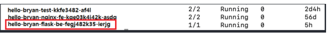

# Kubectl exec 관련
podname 조회
```
kubectl get pods
```

pod name을 찾았으면 pod로 접속해보자

* exec 명령어로 접속   
  ```
  kubectl exec -it hello-bryan-flask-be-fegj482k35-ierjg /bin/bash # 와 같이 접속하면 된다.  
  ```
exec 접속할 때, pod not exist -> 컨트롤플레인과 노드의 internal ip가 다 같아서 일어나는 문제
```
echo "KUBELET_EXTRA_ARGS='--node-ip 192.168.200.50'" | sudo tee /etc/default/kubelet   
sudo systemctl daemon-reload   
sudo systemctl restart kubelet   
```
각노드마다 위의 명령어 수행

워드프레스 컨테이너 targetport를 80으로 해줘야한다.. 정해져있는듯!
